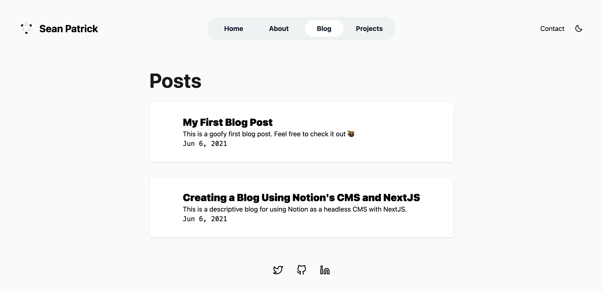

# [shellbear.me](https://seanpatrick.io/)

Source code of my personal website & blog ✨

Check the live version [here](https://seanpatrick.io/) ⚡️




## ✨ Features

- Responsive
- RSS Feed
- Blog with Notion API
- Strongly typed
- Fast thanks to Next.js and Vercel
- GitHub CI to build and lint project

## 📦 Made with

- next.js
- tailwindcss
- vercel
- react-icons
- react-notion-x
- notion API

## 💻 Getting Started

Install dependencies:

```bash
npm install
# or
yarn
```

Then, run the development server:

```bash
npm run dev
# or
yarn dev
```

Open [http://localhost:3000](http://localhost:3000) with your browser to see the result.